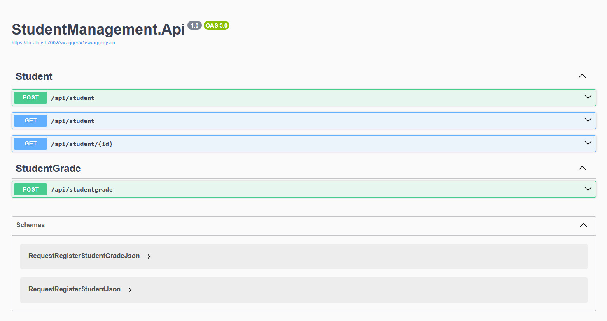
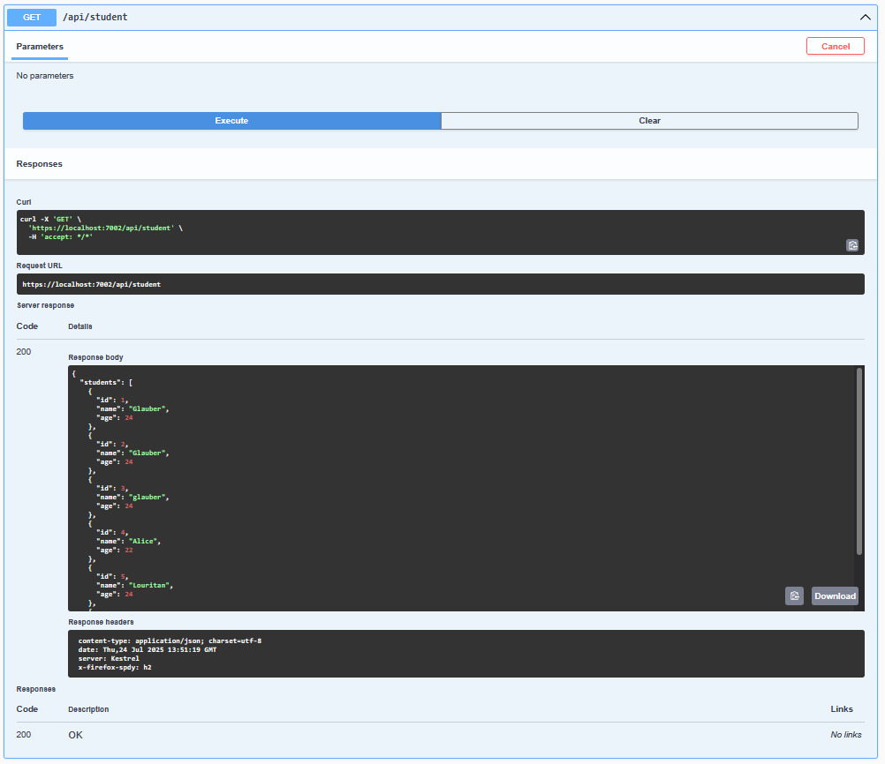
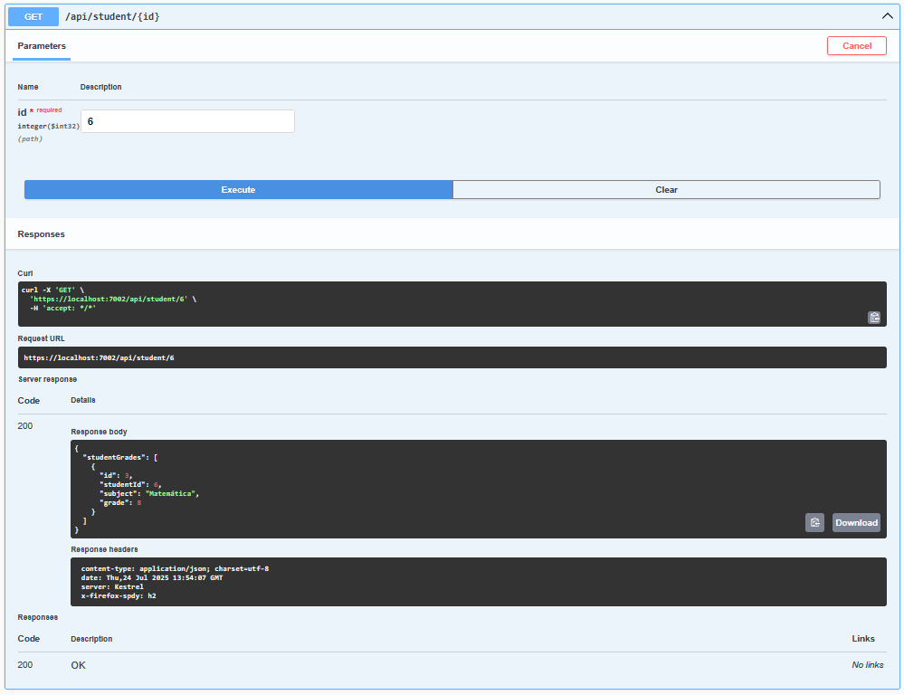
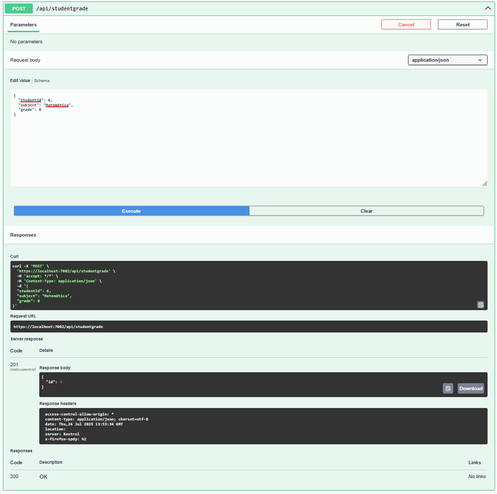
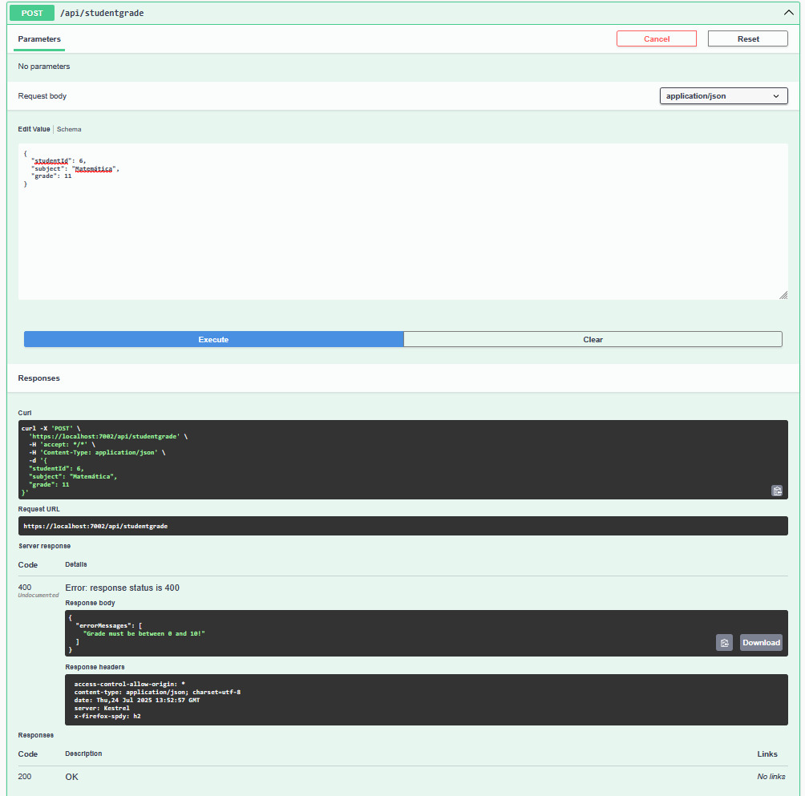

# Student Management API

Uma API RESTful para gerenciamento de estudantes e suas notas, desenvolvida como parte de um desafio técnico.

## 📋 Visão Geral

Este projeto é uma API backend que permite o cadastro e gerenciamento de estudantes e suas notas em diferentes disciplinas. A API foi construída utilizando .NET 8 com arquitetura limpa (Clean Architecture) e seguindo os princípios de SOLID.

## 🚀 Tecnologias Utilizadas

- .NET 8
- ASP.NET Core Web API
- Entity Framework Core
- PostgreSQL 13.1 (containerizado via Docker)
- Docker para infraestrutura
- Swagger para documentação
- Validação Fluente
- Padrão Repository e Unit of Work
- Clean Architecture

## 📁 Estrutura do Projeto

O projeto segue a arquitetura Clean Architecture com as seguintes camadas:

- **StudentManagement.Api**: Camada de apresentação - Controllers e configuração da API
- **StudentManagement.Application**: Camada de aplicação - Use Cases e lógica de negócio
- **StudentManagement.Domain**: Camada de domínio - Entidades e interfaces de repositório
- **StudentManagement.Infrastructure**: Camada de infraestrutura - Implementações de repositório e acesso a dados
- **StudentManagement.Communication**: DTOs, Requests e Responses
- **StudentManagement.Exception**: Exceções personalizadas e gerenciamento de erros

## 🔍 Principais Funcionalidades

### Estudantes
- Cadastro de estudantes
- Listagem de todos os estudantes
- Consulta de notas de um estudante específico

### Notas
- Registro de notas para estudantes
- Associação de notas com disciplinas específicas

## 🛠️ Requisitos para Execução

- .NET 8 SDK ou superior
- PostgreSQL 13.1 ou superior
- Visual Studio 2022, Visual Studio Code ou qualquer IDE com suporte a .NET

## ⚙️ Como Executar

1. **Clone o repositório**
   ```
   git clone <url-do-repositorio>
   cd desafio-tecnico
   ```

2. **Restaure os pacotes**
   ```
   dotnet restore
   ```

3. **Configure o banco de dados PostgreSQL**
   
   É necessário configurar um banco de dados PostgreSQL para executar a aplicação. Você pode usar uma instalação existente ou configurar uma nova.
   
   **Opção recomendada:** O projeto inclui um arquivo `docker-compose.yml` que facilita a configuração do PostgreSQL:
   ```
   docker compose up -d
   ```

4. **Configure a conexão com o banco de dados**
   
   Edite o arquivo `appsettings.json` na pasta StudentManagement.Api para configurar a string de conexão conforme as configurações acima.

5. **Execute as migrações**
   
   Execute os scripts sql students.sql e student-grades.sql localizados na raíz do projeto

6. **Execute o projeto**
   ```
   dotnet run --project src/StudentManagement.Api
   ```

7. **Acesse a documentação da API**
   
   Abra o navegador e acesse `https://localhost:7001/swagger` (a porta pode variar)
   
   

## 📡 Endpoints da API

### Estudantes

- **POST /api/student**: Cadastro de estudante
  ```json
  {
    "name": "Nome do Estudante",
    "age": 18
  }
  ```
  

- **GET /api/student**: Lista todos os estudantes
  

- **GET /api/student/{id}**: Busca as notas de um estudante específico
  

### Notas

- **POST /api/studentgrade**: Cadastra uma nota para um estudante
  ```json
  {
    "studentId": 1,
    "subject": "Matemática",
    "grade": 9.5
  }
  ```
  
  

## 👨‍💻 Autor

Desenvolvido como parte de um desafio técnico.

---

⭐️ Feito com dedicação e atenção aos detalhes. ⭐️
